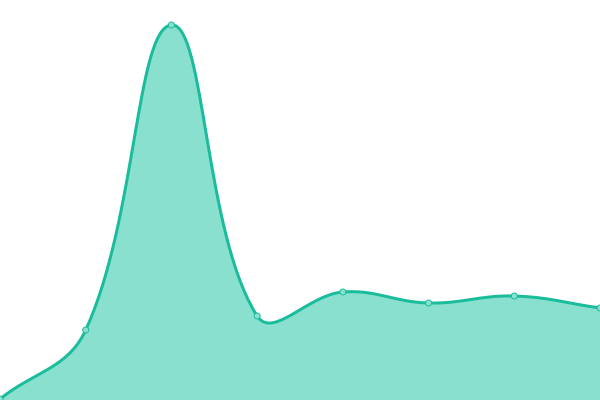
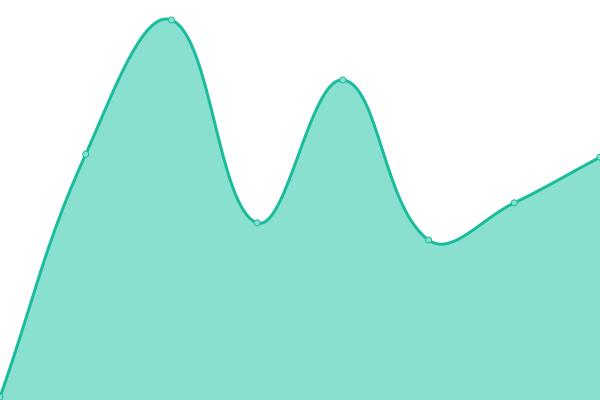

# [📈 Live Status](https://Wujiao233.github.io/host-upptime): <!--live status--> **🟩 All systems operational**

This repository contains the open-source uptime monitor and status page for [Wujiao233](https://Wujiao233.github.io/host-upptime), powered by [Upptime](https://github.com/upptime/upptime).

With [Upptime](https://upptime.js.org), you can get your own unlimited and free uptime monitor and status page, powered entirely by a GitHub repository. We use [Issues](https://github.com/Wujiao233/host-upptime/issues) as incident reports, [Actions](https://github.com/Wujiao233/host-upptime/actions) as uptime monitors, and [Pages](https://Wujiao233.github.io/host-upptime) for the status page.

<!--start: status pages-->
<!-- This summary is generated by Upptime (https://github.com/upptime/upptime) -->
<!-- Do not edit this manually, your changes will be overwritten -->
<!-- prettier-ignore -->
| URL | Status | History | Response Time | Uptime |
| --- | ------ | ------- | ------------- | ------ |
|  [Google](https://www.google.com) | 🟩 Up | [google.yml](https://github.com/Wujiao233/host-upptime/commits/HEAD/history/google.yml) | 

 92ms
     
 | 

<a href="https://Wujiao233.github.io/host-upptime/history/google">100.00%</a>
    

|  [Konachan-CHS](https://konachan.wjcodes.com) | 🟩 Up | [konachan-chs.yml](https://github.com/Wujiao233/host-upptime/commits/HEAD/history/konachan-chs.yml) | 

 2503ms
     
 | 

<a href="https://Wujiao233.github.io/host-upptime/history/konachan-chs">99.64%</a>
    

|  [Konachan-CHS-http](http://konachan.wjcodes.com) | 🟩 Up | [konachan-chs-http.yml](https://github.com/Wujiao233/host-upptime/commits/HEAD/history/konachan-chs-http.yml) | 

 2247ms
     
 | 

<a href="https://Wujiao233.github.io/host-upptime/history/konachan-chs-http">99.67%</a>
    

|  [Blog](https://wp.wjcodes.com) | 🟩 Up | [blog.yml](https://github.com/Wujiao233/host-upptime/commits/HEAD/history/blog.yml) | 

 950ms
     
 | 

<a href="https://Wujiao233.github.io/host-upptime/history/blog">100.00%</a>
    

<!--end: status pages-->

[**Visit our status website →**](https://Wujiao233.github.io/host-upptime)

## 📄 License

- Code: [MIT](./LICENSE) © [Wujiao233](https://Wujiao233.github.io/host-upptime)
- Data in the `./history` directory: [Open Database License](https://opendatacommons.org/licenses/odbl/1-0/)
